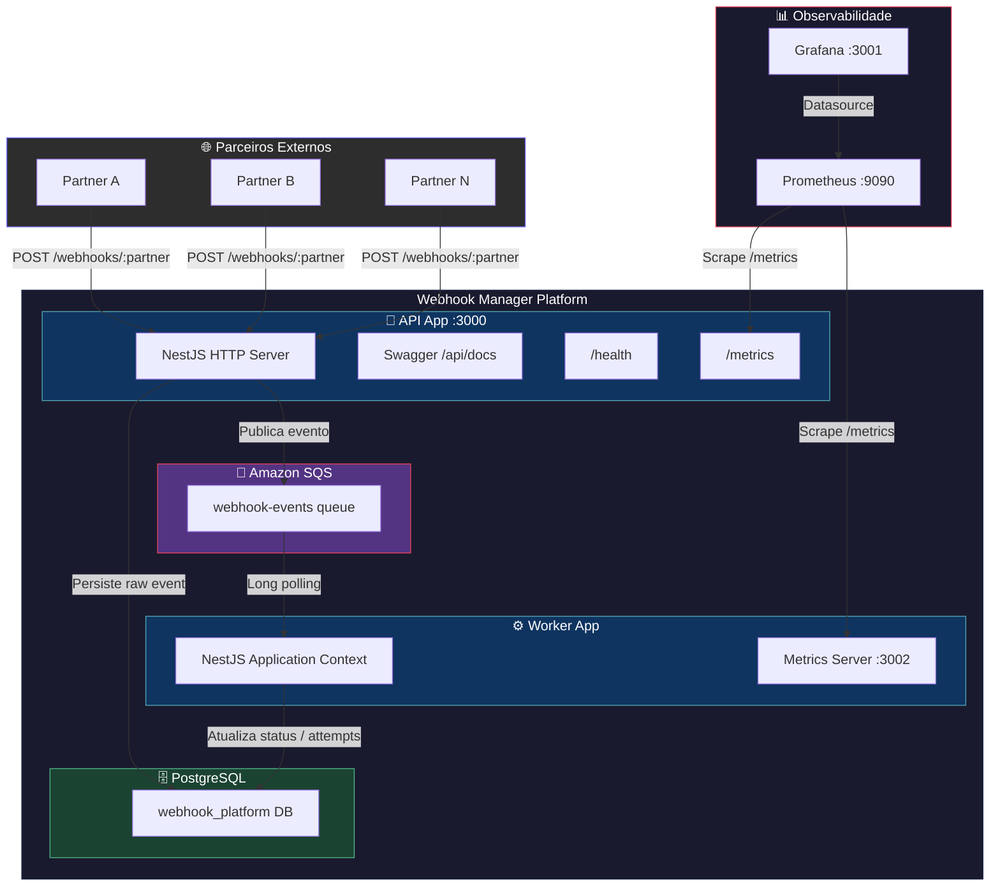
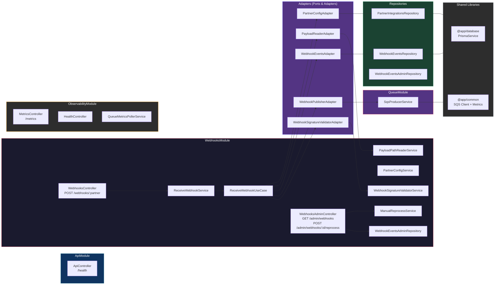
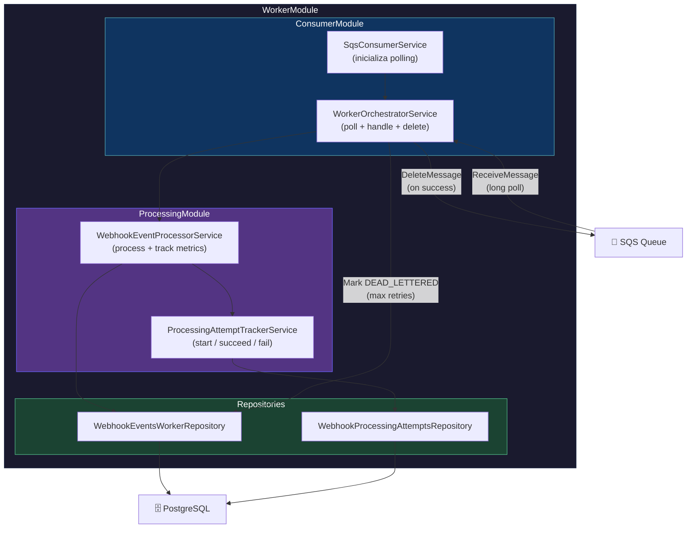
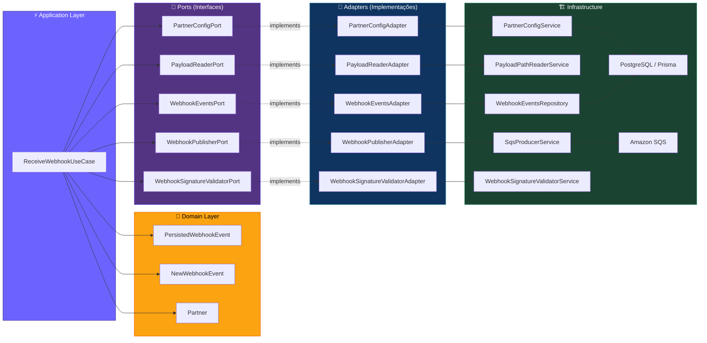
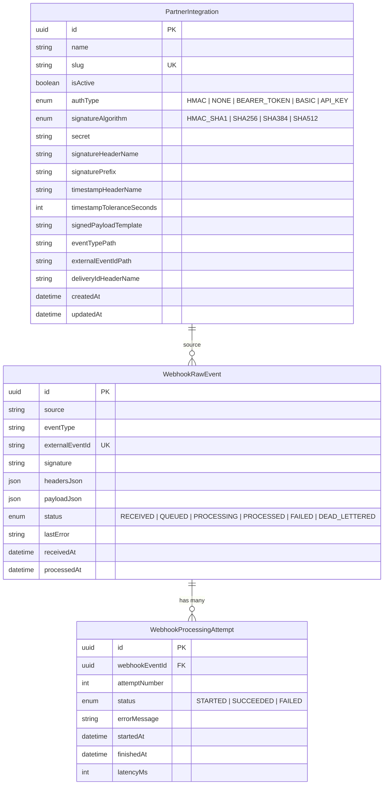
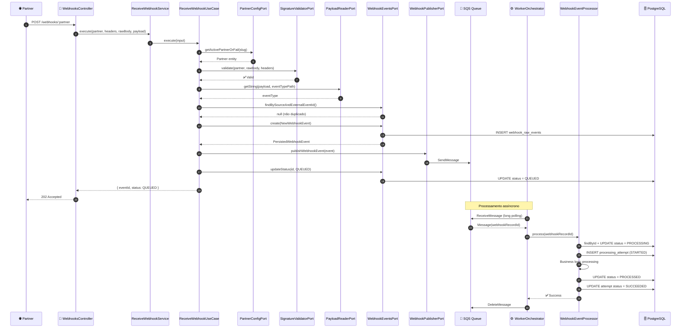

# Webhook Manager — Arquitetura do Software

## 1. Visão Geral da Infraestrutura

Topologia de alto nível do monorepo NestJS com duas aplicações (`api` e `worker`) e a infraestrutura de suporte.

---

## 2. Arquitetura Interna — API App

Módulos NestJS, controllers, services e suas dependências internas.

---

## 3. Arquitetura Interna — Worker App

Pipeline de consumo e processamento de eventos do SQS.

---

## 4. Arquitetura Hexagonal — Ports & Adapters (Webhooks)

O módulo de Webhooks implementa uma **Arquitetura Hexagonal** com inversão de dependência através de ports (interfaces) e adapters (implementações concretas).

---

## 5. Modelo de Dados (ER Diagram)

---

## 6. Fluxo de Vida do Webhook (Sequence Diagram)

Desde o recebimento de um webhook de um parceiro até o processamento final pelo Worker.

